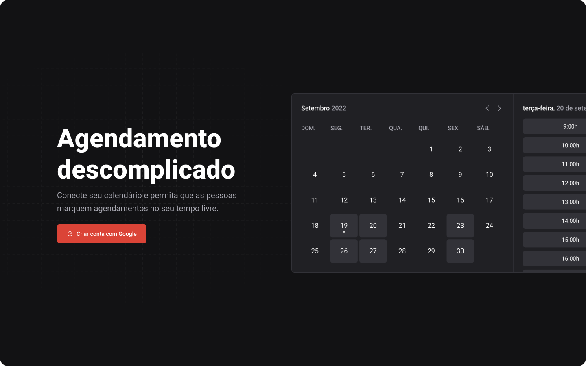

# Simplified Scheduling | Call



## About

The "call" project is a full-stack scheduling application integrated with Google Calendar. It allows you to schedule appointments with other users. Simply create an account on the app and share the link to your calendar. Then, people can schedule a time with you, and the appointment will appear on your Google Calendar.

## Installation

```zsh
git clone https://github.com/manoguii/call.git
```

- To run the project locally:
  1. First, you need to create an account on the platforms with which the project integrates. The project uses [Google](https://console.cloud.google.com/) for user authentication. If you have any doubts, consult the documentation of the tools.
  2. Create a `.env.local` file in the project's root directory and fill in the environment variables as shown in `.env.example`.
  3. Install dependencies: `pnpm install`
  4. Create the local database: `docker run --name mysql -e MYSQL_ROOT_PASSWORD=docker -p 3306:3306 mysql:latest`
  5. Run the migrations: `pnpm exec prisma migrate dev`
  6. Execute the application: `pnpm dev`
  7. Access `http://localhost:3000`

## Technologies

Some technologies used in the construction of the application.

- [ReactJS](https://reactjs.org/)
- [NextJS](https://nextjs.org/)
- [TypeScript](https://www.typescriptlang.org/)
- [stitches](https://stitches.dev/)
- [React Hook Form](https://www.react-hook-form.com/)
- [Zod](https://zod.dev/)
- [Next Auth](https://next-auth.js.org/)
- [Next Seo](https://github.com/garmeeh/next-seo#readme)
- [Google Api](https://github.com/googleapis/google-api-nodejs-client#readme)
- [Prisma](https://www.prisma.io/)
- [React Query](https://tanstack.com/query/v3/)

