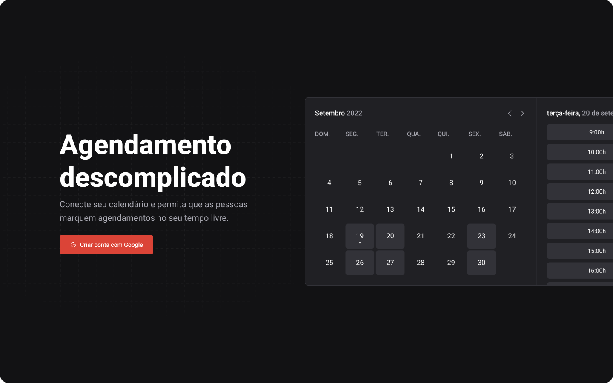

<h1 align="center">
  📅 Call
</h1>

<p align="center">
  
  
  
</p>

<div align="left">
  
</div>

## Instalação

- Crie um app no console do Google para a parte de autenticação.

- Crie um arquivo ```.env.local``` na raiz do projeto e preencha as variáveis ambiente, o exemplo de como deve ficar esta em ```.env.example```

- Clone o repositório
```bash
$ git clone https://github.com/manoguii/call.git
```

- Instale as dependências
```bash
$ npm install
```

- Crie o banco de dados local
```bash
$ docker run --name mysql -e MYSQL_ROOT_PASSWORD=docker -p 3306:3306 mysql:latest
```

- Rodar as migrations
```bash
$ npx prisma migrate dev
```

- Iniciar o projeto
```bash
$ npm run build
$ npm run start
```

## Sobre

O projeto call é uma aplicação full stack de agendamento, integrada ao Google Calendar que permite agendar compromissos com outros usuários, basta criar uma conta no app e enviar o link do seu calendário, ai a pessoa ja vai poder agendar um horário com voce e o compromisso vai aparecer no seu Google Calendar 🚀


## Tecnologias utilizadas 👩🏻‍💻

- [ReactJS](https://reactjs.org/)
- [NextJS](https://nextjs.org/)
- [TypeScript](https://www.typescriptlang.org/)

## Aplicação

O call já está disponível para acesso através do [link](https://call-chi.vercel.app), corre lá e comece a interagir com outras pessoas agora mesmo!  🚀

---

<p align="center">Made with 💙 by Guilherme David</p>